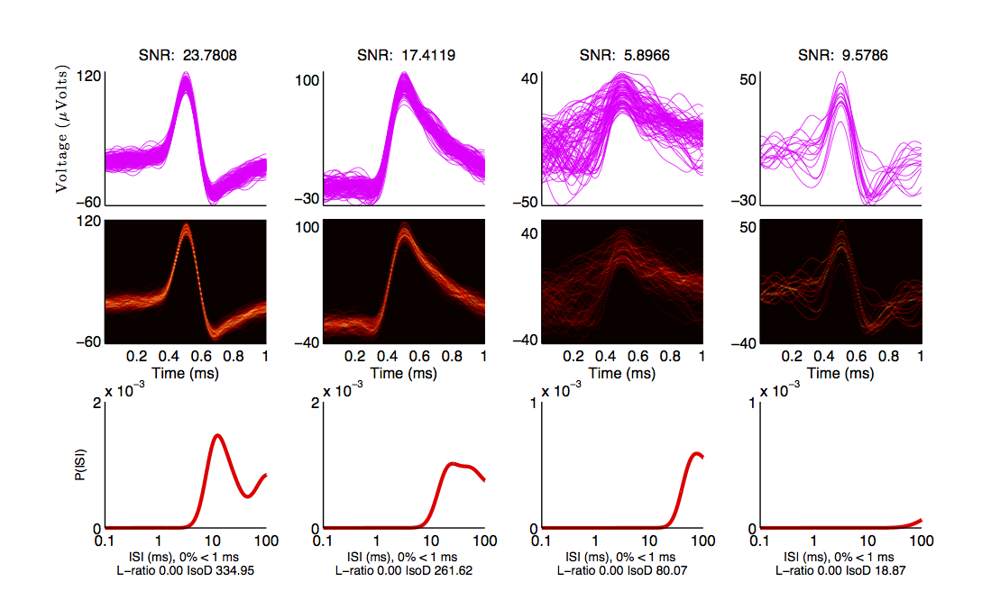
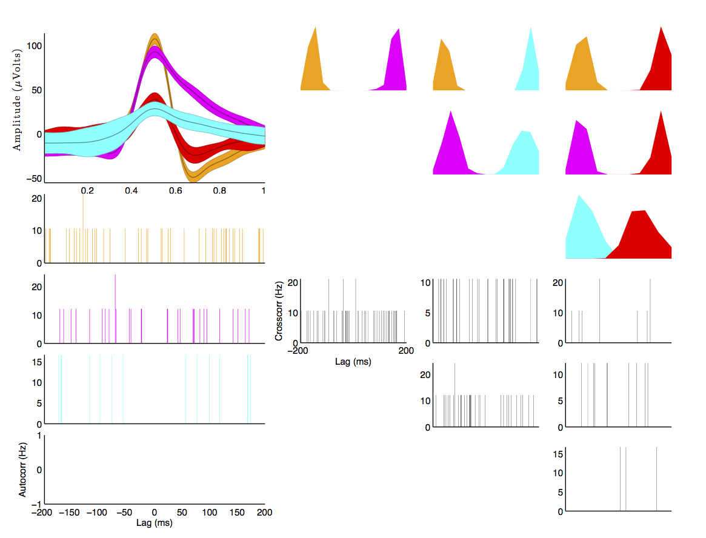
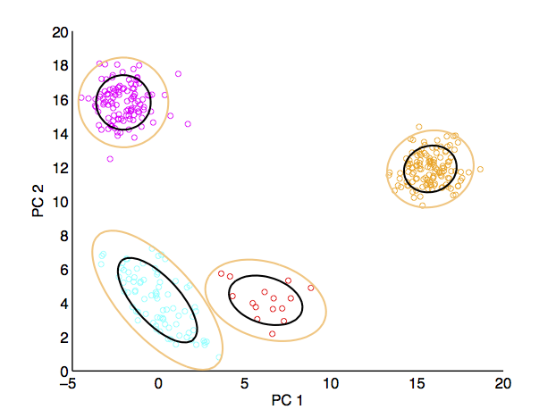

Usage
=====

.. hint:: To pass parameters to any function in the toolbox use parameter/value pairs, see examples below.

.. warning:: Many functions in this toolbox are parallel-enabled (i.e. include parfor loops), check the Parallel Preferences in your MATLAB installation to avoid unwanted behavior.

Quick start
-----------

This toolbox assumes that your data is organized into a samples x trials x channels double-precision Matrix.  For example, if your matrix is 10e3 rows x 100 columns x 1, then the script assumes there are 10e3 time samples and 100 trials (1 trial is fine). To sort your data, try::

  >>cluster=spikoclust_sort(mydata,24e3,'align_feature','min','freq_range',[400 6e3]);

This will attempt to spike sort the data organized into the matrix mydata (sampling rate 24000 Hz).  The waveforms will be filtered between 400 and 6e3 Hz, upsampled using cubic splines, aligned to their minima (use 'max' for maxima or 'com' for center-of-mass), noise whitened and sorted automatically. To sort using a GUI, set the option auto_clust to 0.  Note that all parameters (aside from the first two inputs, data and the sampling rate) are passed as parameter/value pairs (see the help documentation for spikoclust_sort for a detailed description of all options).

The output is a structure that contains: the spike waveforms, the spike times (in samples), the inter-spike-intervals, instantaneous firing rate and some clustering statistics.

To verify that everything is working correctly, download "simulation_1.mat" from `here <http://www2.le.ac.uk/departments/engineering/research/bioengineering/neuroengineering-lab/simulations/simulation-1.mat>`_. This is some simulated data from Rodrigo Quiroga's lab.  Now run the following commands::

  >>[cluster,spikeless]=spikoclust_sort(data,24e3,'freq_range',[400 6e3],'align_feature','max');
  >>spikoclust_autostats(cluster,spikeless);

You should see the following three windows. 

If you want to sort tetrode data, pass a matrix with additional channels (e.g. 10e3 x 100 x 4 would be 10e3 samples by 100 trials by 4 channels).  The first channel is the "master" channel, i.e. spikes will be detected on this channel, and those timepoints will be used to select windows from the other 3 channels.  Windows from the other 3 channels will be appended to the first window before computing the principal components for spike sorting.

Fully automated sorting
-----------------------

``spikoclust_sort`` takes care of all the gory details for you, providing a wrapper for many key steps to spike sorting (extracting spikes, aligning, noise-whitening, cluster).  If you want to perform each of these steps separately in the MATLAB command window (perhaps to pipe output to another program, eh em), see below.  Here are all of the options you can pass to spikoclust_sort.  Note that all options after the second option, the first two being the data matrix and the sampling rate, are as passed parameter/value pairs.

+--------------------+----------------------------------------------------------------------------------+--------------------------------+-------------------------------+-------------------+
| Parameter          | Description                                                                      | Format                         | Options                       | Default           |
+====================+==================================================================================+================================+===============================+===================+
| ``noise_removal``  | Method of noise rejection (common average)                                       | string                         | ``'car','none'``              | ``none``          |
+--------------------+----------------------------------------------------------------------------------+--------------------------------+-------------------------------+-------------------+
| ``car_trim``       | If using common average, trim N/2 percent of data on each end before taking mean | float                          | N/A                           | ``40``            |
+--------------------+----------------------------------------------------------------------------------+--------------------------------+-------------------------------+-------------------+
| ``freq_range``     | Frequency range for filtering                                                    | 1-2 element vector of floats   | N/A                           | ``[400]``         |
+--------------------+----------------------------------------------------------------------------------+--------------------------------+-------------------------------+-------------------+
| ``filt_type``      | Filter class                                                                     | ``high,low,bandpass``          | string                        | ``high``          |
+--------------------+----------------------------------------------------------------------------------+--------------------------------+-------------------------------+-------------------+
| ``filt_order``     | Filter order                                                                     | integer                        | N/A                           | ``3``             |
+--------------------+----------------------------------------------------------------------------------+--------------------------------+-------------------------------+-------------------+
| ``filt_name``      | Filter type                                                                      | string                         | ``'butter','ellip','kaiser'`` | ``'ellip'``       |
+--------------------+----------------------------------------------------------------------------------+--------------------------------+-------------------------------+-------------------+
| ``sigma_t``        | Detection threshold (multiple of robust standard deviation)                      | float                          | N/A                           | ``4``             |
+--------------------+----------------------------------------------------------------------------------+--------------------------------+-------------------------------+-------------------+
| ``detect_method``  | Detect negative-going spikes, positive-going spikes, or both                     | string                         | ``n,p,b``                     |                   |
+--------------------+----------------------------------------------------------------------------------+--------------------------------+-------------------------------+-------------------+
| ``spike_window``   | Size of spike window (in s before and after spike)                               | 2 element vector of floats (s) | N/A                           | ``[.0005 .0005]`` |
+--------------------+----------------------------------------------------------------------------------+--------------------------------+-------------------------------+-------------------+
| ``interp_f``       | Interpolation factor (interpolate spikes by a factor of N)                       | integer                        | N/A                           | ``8``             |
+--------------------+----------------------------------------------------------------------------------+--------------------------------+-------------------------------+-------------------+
| ``align_feature``  | Feature used for spike re-alignment                                              | string                         | ``'min','max','com'``         | ``'min'``         |
+--------------------+----------------------------------------------------------------------------------+--------------------------------+-------------------------------+-------------------+
| ``jitter``         | Limit on number of samples a spike may be moved for re-alignment                 | integer                        | N/A                           | ``10``            |
+--------------------+----------------------------------------------------------------------------------+--------------------------------+-------------------------------+-------------------+
| ``gui_clust``      | Use the GUI assistant                                                            | logic                          | N/A                           | ``1``             |
+--------------------+----------------------------------------------------------------------------------+--------------------------------+-------------------------------+-------------------+
| ``clust_check``    | Number of spikes to check for                                                    | vector of integers             | N/A                           | ``[2:8]``         |
+--------------------+----------------------------------------------------------------------------------+--------------------------------+-------------------------------+-------------------+
| ``pcs``            | Number of principal components to compute/use                                    | integer                        | N/A                           | ``2``             |
+--------------------+----------------------------------------------------------------------------------+--------------------------------+-------------------------------+-------------------+
| ``garbage``        | Use a garbage component in the mixture to exclude outliers?                      | logic                          | N/A                           | ``1``             |
+--------------------+----------------------------------------------------------------------------------+--------------------------------+-------------------------------+-------------------+
| ``smem``           | Use split-and-merge EM rather than standard EM?                                  | logic                          | N/A                           | ``1``             |
+--------------------+----------------------------------------------------------------------------------+--------------------------------+-------------------------------+-------------------+
| ``modelselection`` | Technique to use for selecting the number of neurons                             | string                         | ``'icl','bic','aic'``         | ``'icl'``         |
+--------------------+----------------------------------------------------------------------------------+--------------------------------+-------------------------------+-------------------+
| ``maxnoisetraces`` | Maximum number of traces to use to compute noise covariance                      | integer                        | N/A                           | ``1e6``           |
+--------------------+----------------------------------------------------------------------------------+--------------------------------+-------------------------------+-------------------+
| ``noisewhiten``    | Enable noise whitening?                                                          | logic                          | N/A                           | ``1``             |
+--------------------+----------------------------------------------------------------------------------+--------------------------------+-------------------------------+-------------------+

Stepwise sorting
----------------

Denoising (optional)
^^^^^^^^^^^^^^^^^^^^

Assume you have loaded in a matrix of voltage traces, 40,0000 samples x 10 channels x 1 trial, as the variable ``data``.  As a first step you may want to denoise the data using a command trimmed-average reference (this step is completely optional, feel free to skip to the next section if you just want to filter your data).  This is achieved with ``spikoclust_denoise_signal``::

  >>denoised_data=spikoclust_denoise(data,[],[],'car_exclude',5,'car_trim',40,'method','car');

The first option passed is the data itself, the second option is a vector specifying the channel numbers for the data (e.g. it could be 2-11 instead of 1-10), the second option specified which channel to output.  Typically you'll simply want to simply leave this empty, which will include all channels and return all channels.  All options after the third are passed as parameter/value pairs.

+-----------------+----------------------------------------------------------------------------------+--------+-------------------------+----------+
| Parameter       | Description                                                                      | Format | Options                 | Default  |
+=================+==================================================================================+========+=========================+==========+
| ``car_trim``    | If using common average, trim N/2 percent of data on each end before taking mean | float  | N/A                     | ``40``   |
+-----------------+----------------------------------------------------------------------------------+--------+-------------------------+----------+
| ``car_exclude`` | Channels to exclude from common average                                          | int    | N/A                     | ``[]``   |
+-----------------+----------------------------------------------------------------------------------+--------+-------------------------+----------+
| ``method``      | Denoising method                                                                 | string | ``'car'`` or ``'none'`` | ``none`` |
+-----------------+----------------------------------------------------------------------------------+--------+-------------------------+----------+

Filtering (optional)
^^^^^^^^^^^^^^^^^^^^

If you are working with broadband recordings, you will most likely want to filter out high frequency noise and local field potentials (content ``<300 (Hz)``).  This is done through ``spikoclust_condition_signal``::

  >>filtered_data=spikoclust_condition_signal(data,'single_unit','fs',fs);

This will use the filter defaults for single unit data (2nd order Butterworth high-pass, corner frequency 800 Hz).  They can be overridden using parameter/value pairs.  All options after the second option are passed as parameter/value pairs.  The second argument will change the defaults, e.g.::
  
  >>filtered_data=spikoclust_condition_signal(data,'multi_unit','fs',fs);

Will use filters more appropriate for multi-unit data.

+---------------------+------------------------------------------------------------------+-------------------------------+--------------------------------------------+------------+
| Parameter           | Description                                                      | Format                        | Options                                    | Default    |
+=====================+==================================================================+===============================+============================================+============+
| ``freq_range``      | filter corner(s) (Hz)                                            | float (2 floats for bandpass) | N/A                                        | ``800``    |
+---------------------+------------------------------------------------------------------+-------------------------------+--------------------------------------------+------------+
| ``filt_order``      | filter order                                                     | int                           | N/A                                        | ``2``      |
+---------------------+------------------------------------------------------------------+-------------------------------+--------------------------------------------+------------+
| ``filt_name``       | name of filter type                                              | string                        | ``'Butter','Kaiser','Elliptic','Wavelet'`` | ``Butter`` |
+---------------------+------------------------------------------------------------------+-------------------------------+--------------------------------------------+------------+
| ``demean``          | Demean data?                                                     | logical                       | N/A                                        | ``false``  |
+---------------------+------------------------------------------------------------------+-------------------------------+--------------------------------------------+------------+
| ``rectify``         | Rectify data?                                                    | logical                       | N/A                                        | ``false``  |
+---------------------+------------------------------------------------------------------+-------------------------------+--------------------------------------------+------------+
| ``wavelet_denoise`` | Denoise data using a wavelet decomposition                       | logical                       | N/A                                        | ``false``  |
+---------------------+------------------------------------------------------------------+-------------------------------+--------------------------------------------+------------+
| ``decomp_level``    | Decomposition level for wavelet denoising (wavelet_denoise only) | int                           | N/A                                        | ``7``      |
+---------------------+------------------------------------------------------------------+-------------------------------+--------------------------------------------+------------+
| ``notch``           | Line filter frequency (Hz)                                       | float                         | ``[] for no notch filter``                 | ``[]``     |
+---------------------+------------------------------------------------------------------+-------------------------------+--------------------------------------------+------------+
| ``notch_bw``        | Notch bandwidth                                                  | float                         | N/A                                        | ``100``    |
+---------------------+------------------------------------------------------------------+-------------------------------+--------------------------------------------+------------+
| ``ripple``          | Passband ripple (Elliptic,Kaiser only)                           | float                         | N/A                                        | ``.2``     |
+---------------------+------------------------------------------------------------------+-------------------------------+--------------------------------------------+------------+
| ``attenuation``     | Stopband attenuation (dB; Elliptic,Kaiser only)                  | float                         | N/A                                        | ``40``     |
+---------------------+------------------------------------------------------------------+-------------------------------+--------------------------------------------+------------+
| ``winsigma``        | Gaussian smoothing (sigma, in s)                                 | float                         | ``[] for no smoothing``                    | ``[]``     |
+---------------------+------------------------------------------------------------------+-------------------------------+--------------------------------------------+------------+

Spike detection
^^^^^^^^^^^^^^^

This is the first obligatory step in the pipeline:  extracting spikes from continuous voltage traces using ``spikoclust_spike_detect``.  To quickly get a reasonable threshold you can use the [Quirogaetal2004]_ rule.

.. math:: \text{Threshold}=4\sigma_n\quad\sigma_n=median\left[\frac{|x|}{.6745}\right]

To get the threshold use the following command::

  >>threshold=4*median(abs(sort_data)/.6745);

Then to detect spikes::
  
  >>spikes=spikoclust_spike_detect(sort_data,threshold,fs,'window',[.001 .001],'method','b');

This will detect both positive and negative-going spikes and extract a 1 ms window to the left and right of the alignment event.  If you want to visualize the spikes::

  >>figure();
  >>plot(spikes.windows(:,1:100,1),'k-');

This will plot the first 100 spikes. Now we have a structure that we can use with the rest of the functions for clustering data.

Noise whitening
^^^^^^^^^^^^^^^

Next we will whiten the noise of the data, a critical step pre-clustering (especially if the model assumes white noise!).  First, we need a sample of noise.  To approximate this we remove spikes from the voltage traces with ``spikeless_data``::

  >>spikeless_data=spikoclust_spike_remove(sort_data,spikes);

Copy the pre-whitened windows to a special field for display later on (the noise-whitened traces are less intuitive to look at)::

  >>spikes.storewindows=spikes.windows;

Now whiten the spikes with ``spikoclust_noisewhiten``::

  >>spikes=spikoclust_noisewhiten(spikes,spikeless_data);
  >>figure();
  >>plot(spikes.windows(:,1:100,1),'k-')

Upsampling and realignment
^^^^^^^^^^^^^^^^^^^^^^^^^^

Now the spikes must be upsampled and realigned with ``spikoclust_upsample_align``, then downsampled again before clustering::

  >>spikes=spikoclust_upsample_align(spikes,'interpolate_fs',spikes.fs*8,'align_feature','max');

This upsamples the spikes by a factor of 8 and realigns them to the global max.  

Packaging tetrode data
^^^^^^^^^^^^^^^^^^^^^^

If you're working with tetrodes you'll need to reshape the spike windows (skip this step if you're working with single channel data)::

  >>spikes.windows=reshape(permute(spikes.windows,[1 3 2]),[],ntrials);
  >>spikes.storewindows=reshape(permute(spikes.storewindows,[1 3 2]),[],ntrials);

Study the new matrices to make sure you're good with everything.  Spikes should now be concatenated end-to-end  

.. hint:: For tetrode data, spikes in channels 2-4 are slaved to spikes on channel 1.  To slave to another channel, swap that channel with channel 1.

Robust noise-whitened PCA
^^^^^^^^^^^^^^^^^^^^^^^^^

Following the algorithm of [Sahanithesis]_, we now use a mixture model to perform PCA::

  >>[spike_data,pcs,lam,pcamodel]=spikoclust_robpca(spikes.windows',6);

This returns ``spike_data``, the projection into PC space, ``pcs`` the principal components, the eigenvalues ``lam``, and the model structure ``pcamodel``.

Fitting a Gaussian mixture model
^^^^^^^^^^^^^^^^^^^^^^^^^^^^^^^^

A Gaussian mixture model is fit using the split-and-merge algorithm [Uedaetal2000]_ with ``spikoclust_gmmsort``::

  >>[spike_labels cluster_data cluster_model]=spikoclust_gmmsort(spike_data,'smem',1,'garbage',1,'cluster_check',[1:5],'modelselection','icl');

``spike_labels`` is a vector of labels for each spike in ``spikes.windows``, ``cluster_data`` is the data used for clustering, ``cluster_model`` is a structure with the estimated GMM.  

Manual cluster cutting
^^^^^^^^^^^^^^^^^^^^^^

Alternatively, a GUI can be used to perform a cluster cut using ``spikoclust_guisort``::

  >>[labels model]=spikoclust_guisort(spikes,'pcs',[1:5]);

This will call up a GUI and use the first 5 PCs.  Once you're happy with the clustering, simply close the Data Plotter.

.. [Quirogaetal2004] `Unsupervised Spike Detection and Sorting with Wavelets and Superparamagnetic Clustering <https://dx.doi.org/10.1162/089976604774201631>`_ 
.. [Sahanithesis] `Latent Variable Models for Neural Data Analysis <http://www.gatsby.ucl.ac.uk/~maneesh/thesis/thesis.single.pdf>`_
.. [Uedaetal2000] `Split and Merge EM Algorithm for Improving Gaussian Mixture Density Estimates <https://dx.doi.org/10.1023/A:1008155703044>`_

